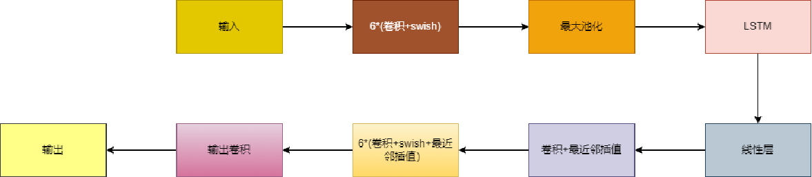
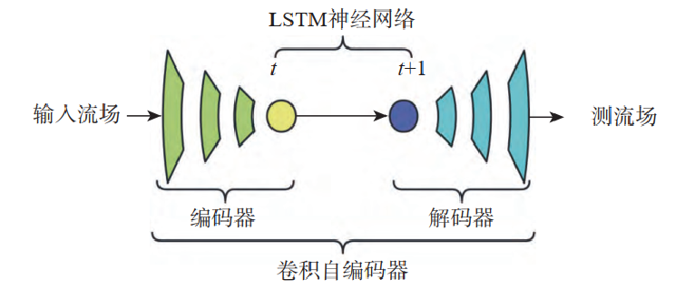
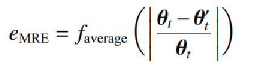
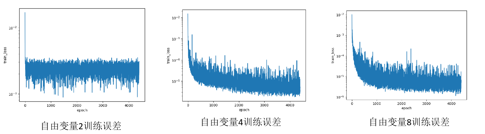
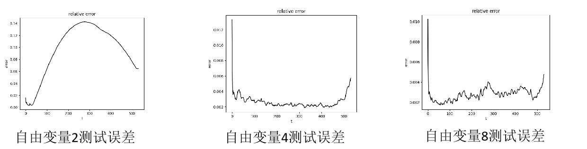
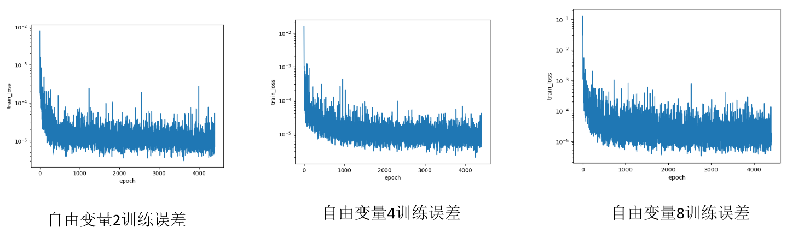

# CAE-LSTM方法求解Sod激波管问题

**本文是CAE-LSTM方法求解Sod激波管问题的MindSpore复现**

## 网络结构

我们复现的CAE-LSTM网络就是采用了**CAE+LSTM**的组合





**整个框架流程：**

1. CAE进行降维，提取特征，编码到隐空间得到自由变量
2. LSTM 对自由变量进行系数时间演化，得到流动其他时刻的自由变量
3. 通过 CAE 网络的解码器将演化的自由变量进行解码，重建原始流场数据


## 数据集

数据集sod.npy（论文作者提供）


## 训练与测试

### 训练

```python
# step1: 训练CAE网络
python cae_train.py 

# step2: 训练CAE-LSTM网络
python lstm_train.py
```

### 测试

```python
python cae_eval.py 
```


## 实验

### 实验设置

#### 验证CAE重建性能

setting：自由变量：2，4，8，学习率：0.001，batchsize：10，epoch：4400，训练数据为前70个时间步的数据

#### 验证CAE-LSTM预测性能

使用CAE重建性能实验中训练出的三个模型继续训练LSTM模型。

setting：LSTM设置两层，神经元数量：200，移动窗口：70


#### 评价指标

平均重建误差

 

其中θ和θ’是真实流场和重构流场

### 实验结果

#### 第一组实验结果





|   **CAE**重构    | **自由变量**2 | **自由变量**4 | **自由变量**8 |
| :--------------: | :-----------: | :-----------: | :-----------: |
| 测试平均重建误差 |   0.097073    |    0.00264    |    0.00278    |

#### 第二组实验结果




| **CAE-LSTM**重构 | **自由变量**2 | **自由变量4** | **自由变量8** |
| :--------------: | :-----------: | :-----------: | :-----------: |
| 测试平均重建误差 |    0.10577    |   0.004916    |   0.004984    |

## 总结

我们基于华为mindspore框架实现了CAE-LSTM方法求解Sod激波管问题中的代码框架并复现了Sod实验的全部结果

自由变量4和8的情况下完美复现了论文的实验结果和情况

但自由变量2的情况和论文出入较大，可能缺少一些必要配置

总体而言，复现代码没有问题

